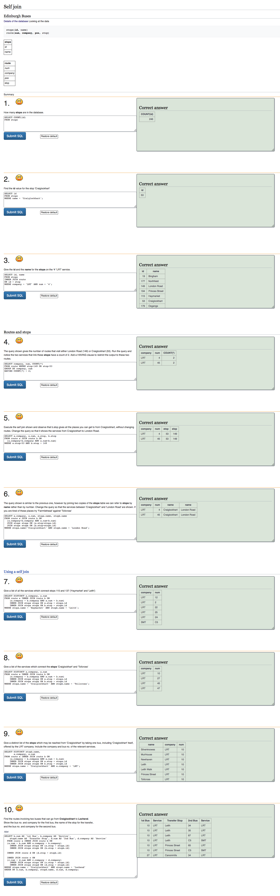

# SQL-Zoo-Answers

> In this repository you will find all the answers for the **Advanced** tutorial on SQL: 'SQL-Zoo' which can be found at https://sqlzoo.net/wiki/SQL_Tutorial.

This is a project which is part of Microverse's SQL and Databases course. I completed all the quizzes and exercises in SQL Zoo with a perfect score. This **advanced** set of excercises includes the following topics:
- Advanced SELECT
- SELECT within SELECT
- AGGREGATEs
- INNER JOINS
- OUTER JOINS
- Using NULL
- Conditional CASE
- SELF JOINS

## Built With

- SQL
- VSCode, Github

## Getting Started

To make use of this excercises follow these simple steps.

### Setup
1. Open your terminal or command prompt.
2. If you don't have git installed in your system, skip this step and go to step 3. If you do have git installed in your system, clone this repository to your computer in any directory you want by copying this text into your command prompt/terminal: `git clone https://github.com/StarSheriff2/SQL-Zoo-Answers.git`. Now go to step 6.
3. If you don't have git installed in your system, you can download the program files. To do this, click on the green button that says "**Code**", on the upper right side of the project frame.
4. You will see a dropdown menu. Click on "**Download ZIP**".
5. Go to the directory where you downloaded the **ZIP file** and open it. Extract its contents to any directory you want in your system.
6. Go to the directory where you cloned the remote repository or extracted the project files.
7. Open the file called **'SQL_Zoo_answers.sql'**

### Usage
1. If you want to use the answers, go to https://sqlzoo.net/wiki/SQL_Tutorial.
2. Find the Tutorial you want to use.
3. Search for the title of the tutorial in the SQL file **'SQL_Zoo_answers.sql'**.
4. All the answers are in the same order they are given in SQL Zoo, as of January 27, 2021

## Authors

👤 **Arturo Alvarez**

- GitHub: [@StarSheriff2](https://github.com/StarSheriff2)
- Twitter: [@Turo_83](https://twitter.com/Turo_83)
- LinkedIn: [Carlos Alvarez](https://www.linkedin.com/in/carlosalvarezveroy/)

## Contributing

Contributions, issues, and feature requests are welcome!

Feel free to check the [issues page](https://github.com/StarSheriff2/SQL-Zoo-Answers/issues).

## Show your support

Give a ⭐️ if you like this project!

## 📝 License

This project is [MIT](https://github.com/StarSheriff2/SQL-Zoo-Answers/blob/main/LICENSE) licensed.
